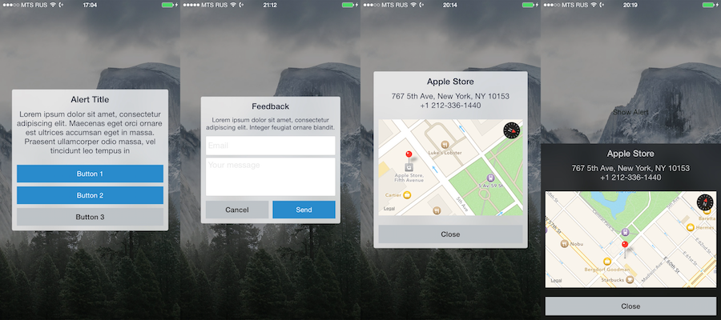

# ADAlertController



## Synopsis

ADAlertController - `UIAlertController` replacement with block-based API.

`ADAlertController` shows alert messages.

Supports two styles:

- `ADAlertControllerStyleAlert` - By default an alert displayed modally in the center of the screen
- `ADAlertControllerStyleActionSheet` - By default an action sheet displayed modally at the bottom of the screen

You can also associate actions with your alert controller for user interaction.

With `ADAlertControllerStyleAlert` you will be able to:

 * Add text fields and text views. Add validators for each text field and text view.
 * Add any custom content view to an alert controller and/or a custom header view.

## Details

### Text Fields and Text Views

Configure `ADAlertController` with `ADAlertControllerStyleAlert` style to be able to add text fields and text views.

A text field is an instance of `ADAlertControllerTextField`, a text view is an instance of `ADAlertControllerTextView`.

`ADAlertControllerTextField` subclasses `UITextField` with implemented text validation.
To add a text field to `ADAlertController` instance use `addTextField:` method.

`ADAlertControllerTextView` subclasses `UITextView` with implemented text validation. To add a text view to `ADAlertControllerAction` instance use `addTextView:` method. Similarly to `UITextField` `ADAlertControllerTextView` implements placeholder.

Mentioned methods support blocks for configuring your text field/text view.

Text fields and text views could be accessed from an instance of `ADAlertController` through `textFields` and `textViews` respectively.

#### Validating entered text

Both `ADAlertControllerTextView` and `ADAlertControllerTextField` are able to validate text values. Use `addValidator:` and `addValidators:` methods to add validators to an instance.

Each validator is an instance of `ADAlertControllerTextValidator`. When you create an instance of `ADAlertControllerTextValidator` you should specify regexp string or a block wich will be used to validate entered text:

```objective-c

NSRegularExpression *emailRegexp = [NSRegularExpression regularExpressionWithPattern:@"^[A-Z0-9a-z\\._%+-]+@([A-Za-z0-9-]+\\.)+[A-Za-z]{2,6}$" options:0 error:nil]
 ADAlertControllerTextValidator *emailValidator = [[ADAlertControllerTextValidator alloc] initWithRegexp: emailRegexp];
 ];
```

```objective-c
ADAlertControllerTextValidator *messageValidator = [[ADAlertControllerTextValidator alloc] initWithValidateBlock:^BOOL(NSString * _Nonnull text) {
    if(text.length == 2 || text.length == 10) {
        return YES;
    }
    return NO;
}];
```

### Actions

Every action is an instance of `ADAlertControllerAction`. For each action `ADAlertController`
creates and configures a button. When a user taps that button, the alert controller executes
a block which you specified on instance creation.

When you create an action, you can specify action params (title and style of a button and a handler to executed on tap).

Actions are added to an instance of `ADAlertControllerAction` using either `addAction:` or `addActions:` method.

## Usage

### Prerequisites

- Apps using ADAlert can target: iOS 8 or later.
- Xcode 6 or later required.

### Installation

1. Download the latest release and unzip it.
2. Go to your Xcode project’s "General" settings. Drag unzipped ADAlert.framework to the "Embedded Binaries" section.

### Examples

```objective-c
ADAlertController *alert = [[ADAlertController alloc] initWithTitle:@"Alert title"
                                                            message:@"Alert message"
                                                              style:ADAlertControllerStyleAlert];

alert.animation = [ADAlertControllerAnimationRotate new];
alert.popoverPresentationController.sourceRect = self.button.bounds;
alert.popoverPresentationController.sourceView = self.button;

ADAlertController __weak *weakAlert = alert;

alert.backgroundTapHandler = ^{
    [weakAlert dismissViewControllerAnimated:YES completion:nil];
};

// Actions
[alert addAction:[[ADAlertControllerAction alloc] initWithTitle:@"Send" 
                                       style:ADAlertControllerActionStyleDefault 
                                     handler:^(ADAlertControllerAction *action) {
    ADAlertControllerTextField *emailTextField = weakAlert.textFields[0];
    ADAlertControllerTextView *messageTextView = weakAlert.textViews[0];
    if([emailTextField isValidText] && [messageTextView isValidText]) {
        NSLog(@"OK!");
        [weakAlert dismissViewControllerAnimated:YES completion:nil];
    }
}]];

[alert addAction:[[ADAlertControllerAction alloc] initWithTitle:@"Cancel" 
                                      style:ADAlertControllerActionStyleCancel 
                                    handler:^(ADAlertControllerAction *action) {
    [weakAlert dismissViewControllerAnimated:YES completion:nil];
}]];

// Text Field
[alert addTextField:^(ADAlertControllerTextField * _Nonnull field) {
    field.placeholder = @"Email";
    NSRegularExpression *emailRegexp = [NSRegularExpression regularExpressionWithPattern:@"^[A-Z0-9a-z\\._%+-]+@([A-Za-z0-9-]+\\.)+[A-Za-z]{2,6}$" options:0 error:nil];
    ADAlertControllerTextValidator *emailValidator = [[ADAlertControllerTextValidator alloc] initWithRegexp:emailRegexp];
    [field addValidator:emailValidator];
}];

// Text View
[alert addTextView:^(ADAlertControllerTextView * _Nonnull textView) {
    textView.placeholder = @"Your message";
    ADAlertControllerTextValidator *messageValidator = [[ADAlertControllerTextValidator alloc] initWithValidateBlock:^BOOL(NSString * _Nonnull text) {
        if(text.length == 2 || text.length == 10) {
            return YES;
        }
        return NO;
    }];
    [textView addValidator:messageValidator];
}];

```

## License

The MIT License (MIT)

Copyright © 2015 Anton Dobkin.

Permission is hereby granted, free of charge, to any person obtaining a copy
of this software and associated documentation files (the "Software"), to deal
in the Software without restriction, including without limitation the rights
to use, copy, modify, merge, publish, distribute, sublicense, and/or sell
copies of the Software, and to permit persons to whom the Software is
furnished to do so, subject to the following conditions:

The above copyright notice and this permission notice shall be included in
all copies or substantial portions of the Software.

THE SOFTWARE IS PROVIDED "AS IS", WITHOUT WARRANTY OF ANY KIND, EXPRESS OR
IMPLIED, INCLUDING BUT NOT LIMITED TO THE WARRANTIES OF MERCHANTABILITY,
FITNESS FOR A PARTICULAR PURPOSE AND NONINFRINGEMENT. IN NO EVENT SHALL THE
AUTHORS OR COPYRIGHT HOLDERS BE LIABLE FOR ANY CLAIM, DAMAGES OR OTHER
LIABILITY, WHETHER IN AN ACTION OF CONTRACT, TORT OR OTHERWISE, ARISING FROM,
OUT OF OR IN CONNECTION WITH THE SOFTWARE OR THE USE OR OTHER DEALINGS IN
THE SOFTWARE.
